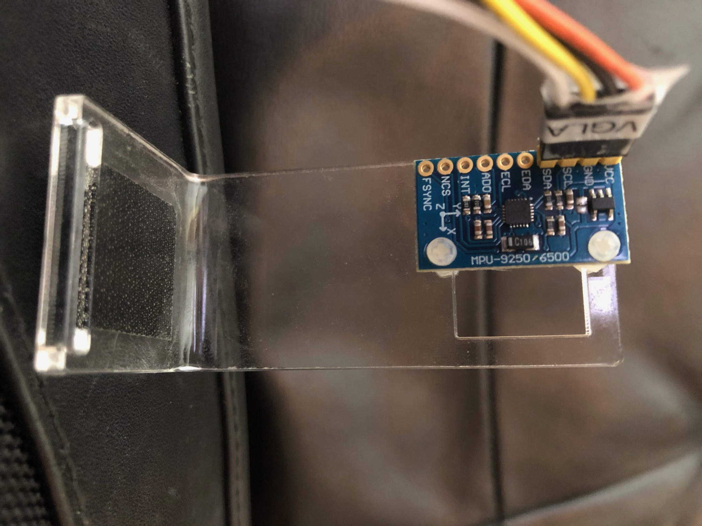

Notes

Code is based on https://github.com/MarkSherstan/MPU-6050-9250-I2C-CompFilter

From the README modified 

# MPU-9250 I2C Complementary Filter
 - Tests two different methods to interface with MPU-9250 via I2C. 
 - main.py uses magnemometers
 - rpi_main.py uses only gyros and accelerometers 
 - Both methods feature the extraction of the raw sensor values as well as the implementation of a complementary filter 
 - for the fusion of the gyroscope and accelerometer to yield an angle(s) in 3 dimensional space.

# Registry Maps and Sensitivity Values
 - Values retrieved below come from the MPU-9250 registry maps and product specifications documents 
   located at https://github.com/MarkSherstan/MPU-6050-9250-I2C-CompFilter/Resources  
   PS-MPU-9250A-01-v1.1.pdf    Product Specification  
   RM-MPU-9250A-00-v1.6.pdf    Register Map  
 - Configure the gyroscope on 0x1B and the accelerometer on 0x1C as per data sheets with the following values 
   (the MPU-6050 and MPU-9250 are interchangeable and all registries are the same):

Accelerometer	Sensitivity	Gyroscope	Sensitivity	Hexadecimal	Binary  
+/- 2g	16384	+/- 250 deg/s	131	0x00	00000000  
+/- 4g	8192	+/- 500 deg/s	65.5	0x08	00001000  
+/- 8g	4096	+/- 1000 deg/s	32.8	0x10	00010000  
+/- 16g	2048	+/- 2000 deg/s	16.4	0x18	00011000  

The slave address is b110100X which is 7 bits long. 
 - The LSB bit of the 7 bit address is determined by the logic level on pin AD0. 
 - This allows two sensors to be connected to the same I2C bus. 
 - When used in this configuration, the address of one of the devices should be b1101000 (pin AD0 is logic low) and 
   the address of the other should be b1101001 (pin AD0 is logic high). Communication will typically take place over the 0x68 register.


# Connecting to Raspberry Pi (I2C is 3.3v so cannot go to GoPiGo3 I2C connectors)
Connect your IMU sensor to Raspberry Pi GPIO connector.
Wiring:
Board   RPi GPIO connector  
VCC	Pin 2 VCC (5v)      
GND	Pin 6 GND           
SCL	Pin 5 SCL           
SDA	Pin 3 SDA 

GPIO connector:
(1  2)
(3  4)
(5  6)


With the sensor correctly wired enter the following in the command line.

i2cdetect -y 1

Which should yield the table below (possible to have the value 0x69) verifying a proper connection:

     0  1  2  3  4  5  6  7  8  9  a  b  c  d  e  f
00:          -- -- -- -- -- -- -- -- -- -- -- -- --  
10: -- -- -- -- -- -- -- -- -- -- -- -- -- -- -- --  
20: -- -- -- -- -- -- -- -- -- -- -- -- -- -- -- --   
30: -- -- -- -- -- -- -- -- -- -- -- -- -- -- -- --  
40: -- -- -- -- -- -- -- -- -- -- -- -- -- -- -- --  
50: -- -- -- -- -- -- -- -- -- -- -- -- -- -- -- --  
60: -- -- -- -- -- -- -- -- 68 -- -- -- -- -- -- --   <-- MPU-9250  
70: -- -- -- -- -- -- -- --  


If command fails: (sudo apt-get install i2c-tools python-smbus)


Notes

Code is based on https://github.com/MarkSherstan/MPU-6050-9250-I2C-CompFilter

From the README modified for GoPiGo3 Hardware I2C connection

# MPU-9250 I2C Complementary Filter
 - Tests two different methods to interface with MPU-9250 via I2C. 
 - main.py uses magnemometers
 - rpi_main.py uses only gyros and accelerometers 
 - Both methods feature the extraction of the raw sensor values as well as the implementation of a complementary filter 
 - for the fusion of the gyroscope and accelerometer to yield an angle(s) in 3 dimensional space.

# Registry Maps and Sensitivity Values
 - Values retrieved below come from the MPU-9250 registry maps and product specifications documents 
   located at https://github.com/MarkSherstan/MPU-6050-9250-I2C-CompFilter/Resources  
   PS-MPU-9250A-01-v1.1.pdf    Product Specification  
   RM-MPU-9250A-00-v1.6.pdf    Register Map  
 - Configure the gyroscope on 0x1B and the accelerometer on 0x1C as per data sheets with the following values 
   (the MPU-6050 and MPU-9250 are interchangeable and all registries are the same):

Accelerometer	Sensitivity	Gyroscope	Sensitivity	Hexadecimal	Binary  
+/- 2g	16384	+/- 250 deg/s	131	0x00	00000000  
+/- 4g	8192	+/- 500 deg/s	65.5	0x08	00001000  
+/- 8g	4096	+/- 1000 deg/s	32.8	0x10	00010000  
+/- 16g	2048	+/- 2000 deg/s	16.4	0x18	00011000  

The slave address is b110100X which is 7 bits long. 
 - The LSB bit of the 7 bit address is determined by the logic level on pin AD0. 
 - This allows two sensors to be connected to the same I2C bus. 
 - When used in this configuration, the address of one of the devices should be b1101000 (pin AD0 is logic low) and 
   the address of the other should be b1101001 (pin AD0 is logic high). Communication will typically take place over the 0x68 register.


# Connecting to GoPiGo3
Connect your IMU sensor to I2C_1 or I2C_2, the outer connectors which are hardware connected I2C ports.
Wiring:
Board   GoPiGo/Grove Connector ("Pin 1" on left when connector plugged into GoPiGo3)
VCC	Pin 2 VCC (5v)
GND	Pin 1 GND
SCL	Pin 3 SCL (Sig 2)
SDA	Pin 4 SDA (Sig 1)

GoPiGo3 setup for Raspbian For Robots will have configured I2C.

With the sensor correctly wired enter the following in the command line.

sudo i2cdetect -y 1

Which should yield the table below (possible to have the value 0x69) verifying a proper connection:

     0  1  2  3  4  5  6  7  8  9  a  b  c  d  e  f
00:          -- -- -- -- -- 08 -- -- -- -- -- -- --   <-- GoPiGo3 Board  
10: -- -- -- -- -- -- -- -- -- -- -- -- -- -- -- --  
20: -- -- -- -- -- -- -- -- -- -- 2a -- -- -- -- --   <-- DI TOF Distance Sensor  
30: -- -- -- -- -- -- -- -- -- -- -- -- -- -- -- --  
40: -- -- -- -- -- -- -- -- -- -- -- -- -- -- -- --  
50: -- -- -- -- -- -- -- -- -- -- -- -- -- -- -- --  
60: -- -- -- -- -- -- -- -- 68 -- -- -- -- -- -- --   <-- MPU-9250  
70: -- -- -- -- -- -- -- --  


If command fails: (sudo apt-get install i2c-tools python-smbus)


# Calibration

Before running the program and sensor fusion algorithms the magnetometer must be calibrated. 

Run:
```
calibrate.py | tee cal.1.out
```
 - and move sensor in figure eights in roll, pitch, yaw directions  
   trying for visiting 360 degrees in each dimension repeatedly.  
 - calibrate.py is main.py with mpu.calibratemagGuide() uncommented.  

 - To understand the results of the calibration refer to the two articles located here and here. 
    https://github.com/kriswiner/MPU6050/wiki/Simple-and-Effective-Magnetometer-Calibration
    https://appelsiini.net/2018/calibrate-magnetometer/


Next copy cal.1.out to data.1.txt, delete first part down to the data,
     skip down to line 3000, bottom of first data points, delete to end of file

Copy data.1.txt to data.txt

Copy the three bias and three scale lines into magCalSlider.py (left justified)
Set the bias and scale list values to approximate the six lines

Run ./magCalSlider.py  

- If get error about magplotlib:  
```
  sudo pip3 freeze | grep magplotlib 
```
  if present, then upgrade:
```
  sudo pip3 install --upgrade matplotlib
```
  if not preset, install:
```
  sudo pip3 install matplotlib  
```

Adjust the bias till all three circles of points are centered on 0,0  
  - Adjust the scale till the circles are "round" 
  - symmetrical like 250, -250 vertical and horizontally on graph  
  - note the values for scale and bias

Edit main.py, enter the values for bias and scale (near bottom of file)
Edit your LOCAL_DECLINATION

This completes the calibration steps.


# Run  ./main.py or python3 main.py

# 9 DOF MPU-9250  Madgwick Filter

The code is based on Kriswiner's C++ MPU-9250 library located here 
    https://github.com/kriswiner/MPU9250
and Sebastian Madgwick's open source IMU and AHRS algorithms located here. 
    https://x-io.co.uk/open-source-imu-and-ahrs-algorithms/

Mounted:


magCalSlider.py Before Calibration:


and After Calibration:


Test Bed - RPi3B with HiLetgo MPU-9250 connected via I2C:

